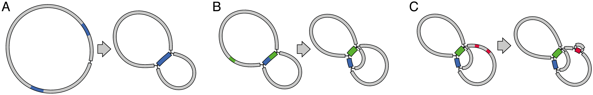
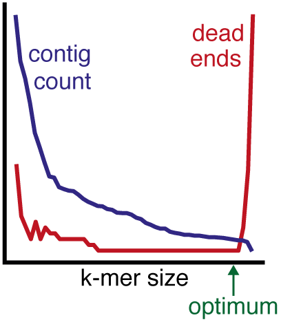
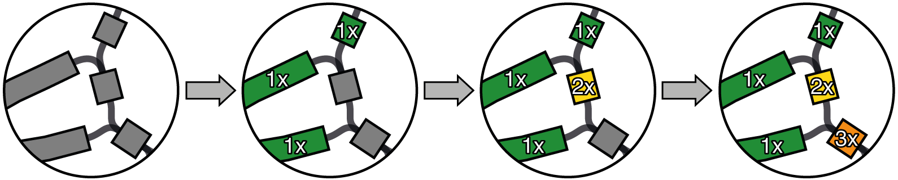
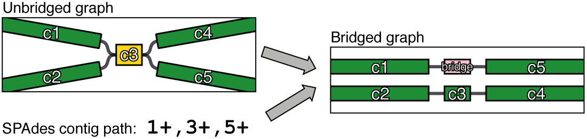
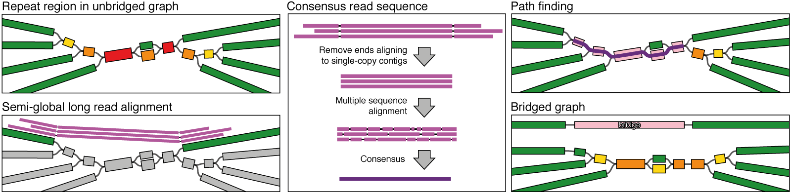
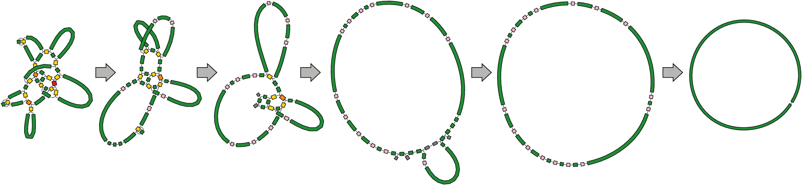
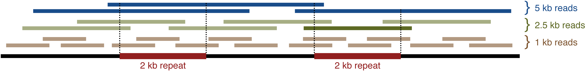
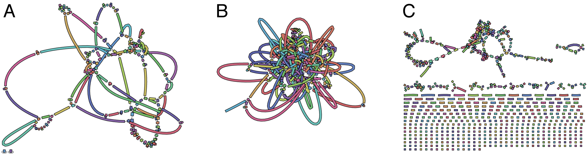
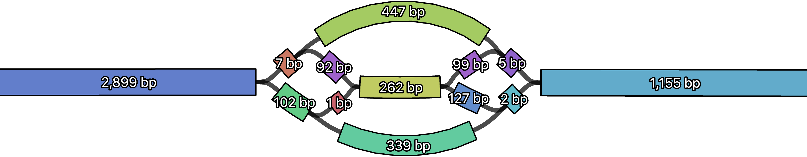
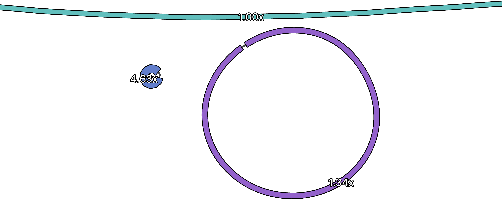

<p align="center"></p>

Unicycler is a hybrid assembly pipeline for bacterial genomes. It uses both [Illumina](http://www.illumina.com/) and [PacBio](http://www.pacb.com/)/[Nanopore](https://nanoporetech.com/) reads to produce complete and accurate assemblies.


# Table of contents

* [Introduction](#introduction)
* [Requirements](#requirements)
* [Installation](#installation)
    * [Typical installation](#typical-installation)
    * [Other installation commands](#other-installation-commands)
* [Quick usage](#quick-usage)
* [How it works](#how-it-works)
    * [Assembly graphs](#assembly-graphs)
    * [Unicycler pipeline in brief](#unicycler-pipeline-in-brief)
    * [1. Read correction](#1-read-correction)
    * [2. SPAdes assembly](#2-spades-assembly)
    * [3. Multiplicity](#3-multiplicity)
    * [4. Short read bridging](#4-short-read-bridging)
    * [5. Long read bridging](#5-long-read-bridging)
    * [6. Bridge application](#6-bridge-application)
    * [7. Finalisation](#7-finalisation)
* [Conservative, normal and bold](#conservative-normal-and-bold)
* [Options and usage](#options-and-usage)
    * [Standard options](#standard-options)
    * [Advanced options](#advanced-options)
* [Output files](#output-files)
* [Tips](#tips)
    * [Running time](#running-time)
    * [Necessary read length](#necessary-read-length)
    * [Poretools](#poretools)
    * [Nanopore: 1D vs 2D](#nanopore-1d-vs-2d)
    * [Bad Illumina reads](#bad-illumina-reads)
    * [Very short contigs](#very-short-contigs)
    * [Chromosome and plasmid depth](#chromosomes-and-plasmid-depth)
    * [Known contamination](#known-contamination)
* [Unicycler align](#unicycler-align)
    * [Semi-global alignment](#semi-global-alignment)
    * [Versus local alignment](#versus-local-alignment)
    * [Example commands](#example-commands)
* [Unicycler polish](#unicycler-polish)
    * [Requirements](#requirements-1)
    * [Process](#process)
    * [Example commands](#example-commands-1)
* [Citation](#citation)
* [Acknowledgements](#acknowledgements)
* [License](#license)


# Introduction

As input, Unicycler takes a good set of Illumina reads from a bacterial isolate (required) and long reads from the same isolate (optional). If the input is sufficient, it will produce a completed assembly of circularised sequences.

Reasons to use Unicycler:
   * It has very low misassembly rates.
   * It can cope with very repetitive genomes, such as [_Shigella_](https://www.ncbi.nlm.nih.gov/pmc/articles/PMC153260/).
   * It correctly handles plasmids of varying depth.
   * It works with long reads of any quality – even Nanopore reads classed as 'fail' can be used as input.
   * It works with any long read depth. Approximately 10x may be required to complete a genome, but it can make nearly-complete genomes with far fewer long reads.
   * Even if you have no long reads, it functions as a [SPAdes](http://bioinf.spbau.ru/spades) optimiser and produces very good Illumina assemblies.
   * It produces an assembly _graph_ in addition to a contigs FASTA file, viewable in [Bandage](https://github.com/rrwick/Bandage).
   * It's easy to use, runs with just one command and doesn't require tinkering with parameters!

Reasons to __not__ use Unicycler:
   * You only have long reads, not Illumina reads (try [Canu](https://github.com/marbl/canu) instead).
   * Your Illumina reads are poor quality (Unicycler requires a good short read assembly graph – [more info here](#bad-illumina-reads)).
   * You're assembling a large eukaryotic genome or a metagenome (Unicycler is designed for bacterial isolates).
   * Your Illumina reads and long reads are from different isolates.
   * You're very impatient (Unicycler is not as fast as alternatives).


# Requirements

* Linux or macOS
* [Python](https://www.python.org/) 3.4 or later
* C++ compiler
    * [GCC](https://gcc.gnu.org/), [Clang](http://clang.llvm.org/) and [ICC](https://software.intel.com/en-us/c-compilers) should all work if the version isn't too old (C++11 support is required).
* [SPAdes](http://bioinf.spbau.ru/spades)

Unicycler needs the following tools for certain parts of its pipeline. They are optional, but without them Unicycler will not be able to perform all pipeline tasks:

* [GraphMap](https://github.com/isovic/graphmap) – can accelerate long read alignment process
* [Pilon](https://github.com/broadinstitute/pilon/wiki) – required for polishing
* Java – required for polishing
* [Bowtie2](http://bowtie-bio.sourceforge.net/bowtie2/) – required for polishing
* [Samtools](http://www.htslib.org/) version 1.0 or later – required for polishing
* [BLAST+](https://www.ncbi.nlm.nih.gov/books/NBK279690/) – required for rotating finished assemblies


# Installation

### Typical installation
```
git clone https://github.com/rrwick/Unicycler.git
cd Unicycler
python3 setup.py install
```
If the last command complains about permissions, you may need to run it with `sudo`.

### Other installation commands

* Install just for your user: `python3 setup.py install --user`
    * If you get a strange 'can't combine user with prefix' error, read [this](http://stackoverflow.com/questions/4495120).
* Install to a specific location: `python3 setup.py install --prefix=$HOME/.local`
* Install with pip (local copy): `pip3 install path/to/Unicycler`
* Install with pip (from GitHub): `pip3 install git+https://github.com/rrwick/Unicycler.git`
* Install with specific Makefile options: `python3 setup.py install --makeargs "CXX=icpc"`
* Build and run without installing:
    * `make`
    * Execute `./unicycler-runner.py` instead of `unicycler`


# Quick usage

__Short read-only assembly:__<br>
`unicycler -1 short_1.fastq.gz -2 short_2.fastq.gz --no_long -o output_dir`

__Hybrid assembly:__<br>
`unicycler -1 short_1.fastq.gz -2 short_2.fastq.gz -l long.fastq.gz -o output_dir`


# How it works

### Assembly graphs

To understand what Unicycler is doing, you need to know about assembly graphs. They come in many different varieties, but essentially an assembly graph is a structure where the contigs don't have to simply end - rather they can lead into other contigs:
```
                        CCTTGTTTAT
                       /          \
...TCGAAACTTGACGCGAGTCG            GCTACTGCTTGATGATGCGG...
                       \          /
                        CTGTCAATTT
```
Most assemblers use graphs as an internal data structure to produce their assemblies. [De Bruijn graphs](http://www.homolog.us/Tutorials/index.php?p=1.1&s=1) are commonly used for short read assemblers and overlap graphs are common for long read assemblers.

If the assembly process was perfect and complete, we'd always get one contig per physical piece of DNA have no need for a graph. But most assemblies are not complete (especially short read assemblies) and in these cases an assembly graph can help us understand the incomplete assembly much better than contigs alone.

The primary reason short read assemblies do not complete is that DNA usually contains _repeats_. When the repeats are longer than the reads (or for paired-end sequencing, longer than the insert size), they are collapsed into a single contig in the assembly graph with multiple connections leading in and multiple connections leading out.

Here is what happens to a simple bacterial assembly graph as you add repeats to the genome:
<p align="center"></p>

We started out with a simple loop corresponding to the circular chromosome, but as repeats were added the graph became increasingly tangled. Real world bacterial assembly graphs get much more complicated.

To complete a bacterial genome assembly (i.e. find one correct sequence for each chromosome/plasmid), we need to resolve the repeats. This means finding which way into a repeat matches up with which way out. Unfortunately, short reads don't have enough information to do this, but _long reads_ do.


### Unicycler pipeline in brief

Unicycler performs an assembly (using SPAdes) of just the Illumina reads. It then uses long read alignments to resolve repeats in the assembly graph. It does this by building 'bridges' between non-repeat contigs using the best path through the assembly graph.

Essentially, Unicycler is a scaffolder which uses long reads to properly arrange Illumina contigs. But unlike a naive scaffolding tool which operates on assembled _contigs_, Unicycler works on an assembly _graph_. This gives it much more information to complete assemblies with a very low risk of mistakes.

Here are the steps it follows, in a bit more detail:

### 1. Read correction

Unicycler uses SPAdes' built-in read correction step before assembling the Illumina reads. This can be disabled with `--no_correct` if your Illumina reads are very high quality or you've already performed read QC.


### 2. SPAdes assembly



Unicycler uses SPAdes to assemble the Illumina reads into an assembly graph. It tries assemblies at a wide range of k-mer sizes, evaluating the graph at each one. It chooses the graph which best minimises both contig count and dead end count. If the Illumina reads are good, it produces an assembly graph with long contigs but few to no dead ends ([more info here](#bad-illumina-reads)).

Unicycler also performs some graph pruning, filtering out contigs which are very low depth. Low-level contamination in the Illumina reads should not be a problem for Unicycler.


### 3. Multiplicity

In order to scaffold the graph, Unicycler must distinguish between single-copy contigs and collapsed repeats. It does this with a greedy algorithm that takes both read depth and graph connectivity. This process finds single-copy contigs not only in the bacterial chromosome but also in plasmids of any read depth.

<p align="center"></p>


### 4. Short read bridging

At this point, the assembly graph does not contain the SPAdes repeat resolution. To apply this to the graph, Unicycler builds bridges between single-copy contigs using the information in the SPAdes `contigs.paths` file. These are applied to the graph to make the `spades_bridges_applied.gfa` output – the most resolved graph Unicycler can make using only the Illumina reads.

<p align="center"></p>


### 5. Long read bridging

Long reads are the most useful source of information for resolving the assembly graph, so Unicycler aligns them to the graph semi-globally (see [Unicycler align](#unicycler-align) for more information). For each pair of single-copy contigs which are linked by read alignments, Unicycler uses the read consensus sequence to find a connecting path and creates a bridge.

<p align="center"></p>


### 6. Bridge application

At this point of the pipeline there can be many bridges, some of which may conflict. Unicycler therefore assigns a quality score to each based on all available evidence (e.g. read alignment quality, graph path match, read depth consistency). Bridges are then applied in order of decreasing quality so whenever there is a conflict, only the most supported bridge is used. A minimum quality threshold prevents the application of low evidence bridges (see [Conservative, normal and bold](#conservative-normal-and-bold) for more information).

<p align="center"></p>


### 7. Finalisation

If the above steps have resulted in any simple, circular sequences, then Unicycler will attempt to rotate/flip them to begin at a consistent starting gene. By default this is [dnaA](http://www.uniprot.org/uniprot/?query=gene_exact%3AdnaA&sort=score) or [repA](http://www.uniprot.org/uniprot/?query=gene_exact%3ArepA&sort=score), but users can specify their own with the `--start_genes` option.

Finally, Unicycler does a single pass of short read polishing using [Pilon](https://github.com/broadinstitute/pilon/wiki). For a more extensive polishing process, see the section on [Unicycler polish](#unicycler-polish)


# Conservative, normal and bold

Unicycler can be run in three modes: conservative, normal (the default) and bold, set with the `--mode` option. Conservative mode is least likely to produce a complete assembly but has a very low risk of misassembly. Bold mode is most likely to produce a complete assembly but carries greater risk of misassembly. Normal mode is intermediate regarding both completeness and misassembly risk.

If the structural accuracy of your assembly is paramount to your research, conservative mode is recommended. If you want a completed genome, even if it contains a mistake or two, then use bold mode.

The specific differences between the three modes are as follows:

Mode         | Invocation                      | Short read bridges | Bridge quality threshold | Contig merging
------------ | ------------------------------- | ------------------ | ------------------------ | -------------------------------------
conservative | `‑‑mode conservative`           | not used           | high (25)                | contigs are only merged with bridges
normal       | `‑‑mode normal`<br>(or nothing) | used               | medium (10)              | contigs are merged with bridges and when their multiplicity is 1
bold         | `‑‑mode bold`                   | used               | low (1)                  | contigs are merged wherever possible

<p align="center"></p>

In the above example, the conservative assembly is incomplete because some bridges fell below the quality threshold and were not applied. Its contigs, however, are extremely reliable. Normal mode nearly gave a complete assembly, but a couple of unmerged contigs remain. Bold mode completed the assembly, but since lower confidence regions were bridged and merged, there is a larger risk of error.


# Options and usage

### Standard options

Run `unicycler --help` to view the program's most commonly used options:

```
usage: unicycler [-h] [--help_all] [--version] -1 SHORT1 -2 SHORT2 [-l LONG] [--no_long] -o OUT [--verbosity VERBOSITY] [--keep_temp KEEP_TEMP] [-t THREADS]
                 [--mode {conservative,normal,bold}] [--expected_linear_seqs EXPECTED_LINEAR_SEQS]

       __
       \ \___
        \ ___\
        //
   ____//      _    _         _                     _
 //_  //\\    | |  | |       |_|                   | |
//  \//  \\   | |  | | _ __   _   ___  _   _   ___ | |  ___  _ __
||  (O)  ||   | |  | || '_ \ | | / __|| | | | / __|| | / _ \| '__|
\\    \_ //   | |__| || | | || || (__ | |_| || (__ | ||  __/| |
 \\_____//     \____/ |_| |_||_| \___| \__, | \___||_| \___||_|
                                        __/ |
                                       |___/

Unicycler: a hybrid assembly pipeline for bacterial genomes

Help:
  -h, --help                            Show this help message and exit
  --help_all                            Show a help message with all program options
  --version                             Show Unicycler's version number

Input:
  -1 SHORT1, --short1 SHORT1            FASTQ file of short reads (first reads in each pair).
  -2 SHORT2, --short2 SHORT2            FASTQ file of short reads (second reads in each pair).
  -l LONG, --long LONG                  FASTQ or FASTA file of long reads, if all reads are available at start.
  --no_long                             Do not use any long reads (assemble with short reads only)

Output:
  -o OUT, --out OUT                     Output directory
  --verbosity VERBOSITY                 Level of stdout information (0 to 3, default: 1)
                                          0 = no stdout, 1 = basic progress indicators, 2 = extra info, 3 = debugging info
  --keep_temp KEEP_TEMP                 Level of file retention (0 to 2, default: 1)
                                          0 = only keep files at main checkpoints, 1 = keep some temp files including SAM, 2 = keep all temp files

Other:
  -t THREADS, --threads THREADS         Number of threads used (default: number of CPUs, up to 8)
  --mode {conservative,normal,bold}     Bridging mode (default: normal)
                                          conservative = smaller contigs, lowest misassembly rate
                                          normal = moderate contig size and misassembly rate
                                          bold = longest contigs, higher misassembly rate
  --expected_linear_seqs EXPECTED_LINEAR_SEQS
                                        The expected number of linear (i.e. non-circular) sequences in the underlying sequence
```

### Advanced options

Run `unicycler --help_all` to see a complete list of the program's options. These allow you to turn off parts of the pipeline, specify the location of tools (only necessary if they are not in PATH) and adjust various settings:
```
SPAdes assembly:
  These options control the short read SPAdes assembly at the beginning of the Unicycler pipeline.

  --spades_path SPADES_PATH             Path to the SPAdes executable
  --no_correct                          Skip SPAdes error correction step
  --min_kmer_frac MIN_KMER_FRAC         Lowest k-mer size for SPAdes assembly, expressed as a fraction of the read length
  --max_kmer_frac MAX_KMER_FRAC         Highest k-mer size for SPAdes assembly, expressed as a fraction of the read length
  --kmer_count KMER_COUNT               Number of k-mer steps to use in SPAdes assembly

Assembly rotation:
  These options control the rotation of completed circular sequence near the end of the Unicycler pipeline.

  --no_rotate                           Do not rotate completed replicons to start at a standard gene
  --start_genes START_GENES             FASTA file of genes for start point of rotated replicons
  --start_gene_id START_GENE_ID         The minimum required BLAST percent identity for a start gene search
  --start_gene_cov START_GENE_COV       The minimum required BLAST percent coverage for a start gene search
  --makeblastdb_path MAKEBLASTDB_PATH   Path to the makeblastdb executable
  --tblastn_path TBLASTN_PATH           Path to the tblastn executable

Pilon polishing:
  These options control the final assembly polish using Pilon at the end of the Unicycler pipeline.

  --no_pilon                            Do not use Pilon to polish the final assembly
  --bowtie2_path BOWTIE2_PATH           Path to the bowtie2 executable
  --bowtie2_build_path BOWTIE2_BUILD_PATH
                                        Path to the bowtie2_build executable
  --samtools_path SAMTOOLS_PATH         Path to the samtools executable
  --pilon_path PILON_PATH               Path to the executable Pilon Java archive file
  --java_path JAVA_PATH                 Path to the java executable
  --min_polish_size MIN_POLISH_SIZE     Sequences shorter than this value will not be polished using Pilon

Graph cleaning:
  These options control the removal of small leftover sequences after bridging is complete.

  --min_component_size MIN_COMPONENT_SIZE
                                        Unbridged graph components smaller than this size will be removed from the final graph
  --min_dead_end_size MIN_DEAD_END_SIZE
                                        Graph dead ends smaller than this size will be removed from the final graph

Long read alignment:
  These options control the alignment of long reads to the assembly graph using Graphmap and/or Unicycler-align

  --temp_dir TEMP_DIR                   Temp directory for working files ("PID" will be replaced with the process ID)
  --contamination CONTAMINATION         FASTA file of known contamination in long reads, e.g. lambda phage spike-in (default: none).
  --no_graphmap                         Do not use GraphMap as a first-pass aligner (default: GraphMap is used)
  --graphmap_path GRAPHMAP_PATH         Path to the GraphMap executable
  --scores SCORES                       Comma-delimited string of alignment scores: match, mismatch, gap open, gap extend
  --low_score LOW_SCORE                 Score threshold - alignments below this are considered poor (default: set threshold automatically)
  --min_len MIN_LEN                     Minimum alignment length (bp) - exclude alignments shorter than this length
  --keep_bad                            Include alignments in the results even if they are below the low score threshold (default: low-scoring alignments are discarded)
  --allowed_overlap ALLOWED_OVERLAP     Allow this much overlap between alignments in a single read
  --kmer KMER                           K-mer size used for seeding alignments
```


# Output files

Depending on the input files and the value used for `--keep_temp`, Unicycler may only only produce some of these. Also, all outputs except for `assembly.gfa` and `assembly.fasta` will be prefixed with a number so they are in chronological order.

File                           | Description
------------------------------ | ---------------------------------------------------------------------------
unbridged_graph.gfa            | short read assembly graph before any bridges have been applied
spades_bridges_applied.gfa     | SPAdes bridges applied, before any cleaning or merging
cleaned.gfa                    | redundant contigs removed from the graph
merged.gfa                     | contigs merged together where possible
long_read_bridges_applied.gfa  | Long read bridges applied, before any cleaning or merging
cleaned.gfa                    | redundant contigs removed from the graph
merged.gfa                     | contigs merged together where possible
final_clean.gfa                | more redundant contigs removed
rotated.gfa                    | circular replicons rotated and/or flipped to a start position
polished.gfa                   | after a round of Pilon polishing
__assembly.gfa__               | __the final assembly in graph format__
__assembly.fasta__             | __the final assembly in FASTA format__ (exact same contigs as assembly.gfa)


# Tips

### Running time

Unicycler is thorough and accurate, but not particularly fast. In particular, the [long read bridging](#long-read-bridging) step of the pipeline can take a while to complete. Two main factors influence the running time: the number of long reads (more reads take longer to align) and the genome size/complexity (finding bridge paths is more difficult in complex graphs).

Unicycler may only take an hour or so to assemble a small, simple genome with low depth long reads. On the other hand, a complex genome with many long reads may take 12 hours to finish or more. If you have a very high depth of long reads, you can make Unicycler run faster by subsampling for only the longest reads.

Using a lot of threads (with the `--threads` option) can make Unicycler run faster too. It will only use up to 8 threads by default, but if you're running it on a big machine with lots of CPU and RAM, then feel free to use more!


### Necessary read length

The length of a long read is very important – typically more than its accuracy. This is because longer reads are more likely to align to multiple single-copy contigs, allowing Unicycler to build bridges.

Consider the following example of a sequence with a 2 kb repeat and three different read sets:
<p align="center"></p>

In order to resolve the repeat, a read must span it by aligning to sequence on either side. In this example the 1 kb reads are shorter than the repeat and are all useless. The 2.5 kb reads _can_ resolve the repeat, but they have to be in _just the right place_ to do so. Only one out of the six in this example is useful. The 5 kb reads, however, have a much easier time spanning the repeat and all three are useful.

So how long must your reads be for Unicycler to complete an assembly? _Longer than the longest repeat in the genome._ Depending on the genome, that might be a 1 kb insertion sequence, a 6 kb ribosomal complex or a 30 kb phage. If your reads are just a little bit longer than the longest repeat, then you'll probably need a lot of them to ensure that at least one spans the repeat. If they are much longer, then fewer reads should suffice. But in any scenario, _longer is better!_


### Poretools

[Poretools](http://poretools.readthedocs.io/en/latest/) can turn your Nanopore FAST5 reads into a FASTQ file appropriate for Unicycler. Here's an example command:
```
poretools fastq --type best --min-length 1000 path/to/fast5/dir/ > nanopore_reads.fastq
```
If you have 2D reads, `--type best` makes Poretools give only one FASTQ read per FAST5 file (if you have 1D reads, you can exclude that option). Adjust the `--min-length 1000` parameter to suit your dataset – a larger value would be appropriate if you have lots of long reads.


### Nanopore: 1D vs 2D

Since Unicycler can tolerate low accuracy reads, [Oxford Nanopore 1D sequencing](https://nanoporetech.com/applications/dna-nanopore-sequencing) is probably preferable to 2D, as it can provide twice as many reads. However, at the time of writing, the 2D library prep supports barcoding. So if you want to sequence multiple samples on a single flow cell, 2D is currently the only option.


### Bad Illumina reads

Unicycler needs decent Illumina reads as input – ideally with uniform read depth and 100% genome coverage.

You can look at the `unbridged_graph.gfa` file (the first graph Unicycler saves to file) in Bandage to get a quick impression of the Illumina read quality:

<p align="center"></p>

__A__ is an very good Illumina read graph – the contigs are long and there are no dead ends. This read set is ideally suited for use in Unicycler.

__B__ is also a good graph. The genome is more complex, resulting in a more tangled structure, but there are still very few dead ends (you can see one in the lower left). This read set would also work well in Unicycler.

__C__ is a disaster! It is broken into many pieces, probably because parts of the genome got no read depth at all. While you can still use Unicycler to resolve this assembly with long reads, the risk of small errors and misassemblies is considerably higher.


### Very short contigs

Confused by very small (e.g. 2 bp) contigs in Unicycler assemblies? Unlike a SPAdes graph where neighbouring sequences overlap by their k-mer size, Unicycler's final graph has no overlaps and the sequences adjoin directly. This means that contigs in complex regions can be quite short. They may be useless as stand-alone contigs but are still very important in the graph structure.

<p align="center"></p>


### Chromosomes and plasmid depth

Unicycler normalises the depth of contigs in the graph to the median value. This typically means that the chromosome has a depth near 1x and plasmids may have different (typically higher) depths.

<p align="center"></p>

In the above graph, the chromosome is at the top and there are two plasmids.  The plasmid on the left occurs in approximately 4 or 5 copies per cell. For the larger plasmid on the right, most cells probably had one copy but some had more. Since sequencing biases can affect read depth, these per cell counts should be interpreted loosely.


### Known contamination

If your long reads have known contamination, you can use the `--contamination` option to supply give Unicycler a FASTA file of the contaminant sequences. Unicycler will then discard any reads for which the best alignment is to the contaminant.

For example, if you've sequenced two isolates in succession on the same Nanopore flow cell, there may be residual reads from the first sample in the second run. In this case, you can supply a reference/assembly of the first sample to Unicycler when assembling the second sample.

Some Oxford Nanopore kits include a lambda phage spike-in as a control. Since this is a common contaminant, you can simply use `--contamination lambda` to filter these out (no need to supply a FASTA file).


# Unicycler align

Unicycler's algorithm for sensitive semi-global alignment is available as a stand-alone alignment tool with the command `unicycler_align`.


### Semi-global alignment

Semi-global alignment (a.k.a. glocal, overlap or free end-gap alignment) will not clip an alignment until one of the two sequences ends. This can be where one sequence is contained within the other or where the two sequences overlap:
```
  TAGAA        GTGCCGGAACA         GGCCACAC     AGTAAGAT
  |||||          |||||||           |||||           |||||
ACTAGAACG        GCCGGAA       GGCTGGCCA           AAGATCTTG
```

In contrast, local alignment will align only the best matching parts, clipping the alignment where the quality becomes poor:
```
      CGAACAGCATACTTG
          ||||||||
ACGTCAGACTCAGCATACGCATCTAGA
```

Semi-global alignment is appropriate when there are no structural differences between the query and reference sequences. For example, when you have a short read assembly graph and long reads from the same bacterial isolate (as is the case in the Unicycler pipeline). In this scenario, there may be small scale differences (due to read errors) but no large scale differences, and semi-global alignment is ideal.


### Versus local alignment

Semi-global alignment is probably not appropriate for mapping reads to a more distant reference genome. It does not cope with points of structural variation between the sample and the reference. For example, if the sample had a deletion relative to the reference, a read spanning that deletion would align poorly with semi-global alignment:
```
read:            AACACTAAACTTAGTCCCAA
                 |||||||||||  |   | |    
reference: GATCCCAACACTAAACTCTGGGGCGAACGGCGTAGTCCCAAGAGT
```

Local alignment (which can align only part of the read) would be more appropriate:
```
read:            AACACTAAACT               TAGTCCCAA
                 |||||||||||               |||||||||
reference: GATCCCAACACTAAACTCTGGGGCGAACGGCGTAGTCCCAAGAGT
```
Try [BWA-MEM](http://bio-bwa.sourceforge.net/), [LAST](http://last.cbrc.jp/) or [BLASR](https://github.com/PacificBiosciences/blasr) if you need a local alignment tool.


### Example commands

__Regular alignment:__<br>
`unicycler_align --reads queries.fastq --ref target.fasta --sam output.sam`

__Only use Unicycler to align (no first pass with GraphMap):__<br>
`unicycler_align --reads queries.fastq --ref target.fasta --sam output.sam --no_graphmap`

__Very sensitive (and slow) alignment:__<br>
`unicycler_align --reads queries.fastq --ref target.fasta --sam output.sam --extra_sensitive`

__Setting some additional thresholds:__<br>
`unicycler_align --reads queries.fastq --ref target.fasta --sam output.sam --min_len 1000 --low_score 80.0`


# Unicycler polish

Unicycler polish is a script to repeatedly polish a completed assembly using all available reads. It can be given Illumina reads, long reads or (ideally) both. When both Illumina and long reads are available, Unicycler polish can fix assembly errors, even in repetitive parts of the genome which cannot be polished by short reads alone.

### Requirements

* If polishing with Illumina reads: [Pilon](https://github.com/broadinstitute/pilon/wiki), Java, [Bowtie2](http://bowtie-bio.sourceforge.net/bowtie2/), [Samtools](http://www.htslib.org/) (version 1.0 or later)
* If polishing with PacBio reads: [pbalign](https://github.com/PacificBiosciences/pbalign), [BLASR](https://github.com/PacificBiosciences/blasr), [GenomicConsensus](https://github.com/PacificBiosciences/GenomicConsensus)
    * PacBio software is most easily installed using [pitchfork](https://github.com/PacificBiosciences/pitchfork).
* If polishing with Nanopore reads: [Nanopolish](https://github.com/jts/nanopolish), [BWA-MEM](http://bio-bwa.sourceforge.net/)
* If polishing with both Illumina and long reads: [FreeBayes](https://github.com/ekg/freebayes)


### Process

Unicycler polish uses an exhaustive iterative process that is time-consuming but can be necessary to resolve the sequence in repeat regions. For example, consider a genome with two very similar regions, A and B, and there are assembly errors in both. Polishing is initially difficult because the errors may cause reads which should map to A to instead map to B and vice versa. However, after some of these errors are fixed, more reads will map to their correct locations, allowing for more errors to be fixes, allowing more reads to map correctly, etc.

1. If Illumina reads are available:
    1. Run [Pilon](https://github.com/broadinstitute/pilon/wiki) in 'bases' mode (substitutions and small indels). If any changes were suggested, apply them and repeat this step.
    2. Run Pilon in 'local' mode (larger variants), and assess each change with ALE. If any variant improves the ALE score, apply it and go back to step 1-i.
2. If long reads are available:
    1. Run [GenomicConsensus](https://github.com/PacificBiosciences/GenomicConsensus)/[Nanopolish](https://github.com/jts/nanopolish) and gather all suggested small changes.
    2. Use [FreeBayes](https://github.com/ekg/freebayes) to assess each long read-suggested change by looking for ambiguity in the Illumina read mapping. If any were found, apply them and go back to step 2-i.
3. If Illumina reads are available:
    1. Execute step 1 again.
    2. Run Pilon/GenomicConsensus/Nanopolish again (all that apply) and assess each suggested variant with ALE. If any improves the ALE score, apply it and repeat this step.


### Example commands

__Polishing with only Illumina reads:__<br>
`unicycler_polish -1 short_reads_1.fastq.gz -2 short_reads_2.fastq.gz -a assembly.fasta`

__Polishing with only PacBio reads:__<br>
`unicycler_polish --pb_bax path/to/*bax.h5 -a assembly.fasta`

__Hybrid read set polishing:__<br>
`unicycler_polish -1 short_reads_1.fastq.gz -2 short_reads_2.fastq.gz --pb_bax path/to/*bax.h5 -a assembly.fasta`


# Citation

Paper in progress... check back soon!


# Acknowledgements

Unicycler would not have been possible without [Kat Holt](https://holtlab.net/), my fellow researchers in her lab and the many other people I work with at the University of Melbourne's [Centre for Systems Genomics](https://sysgenmelb.org/). In particular, [Margaret Lam](https://scholar.google.com.au/citations?user=cWmhzUIAAAAJ&hl=en), [Kelly Wyres](https://holtlab.net/kelly-wyres/) and [David Edwards](https://scholar.google.com.au/citations?hl=en&user=rZ1RJK0AAAAJ) worked with me on many challenging genomes during Unicycler's development.


# License

[GNU General Public License, version 3](https://www.gnu.org/licenses/gpl-3.0.html)
